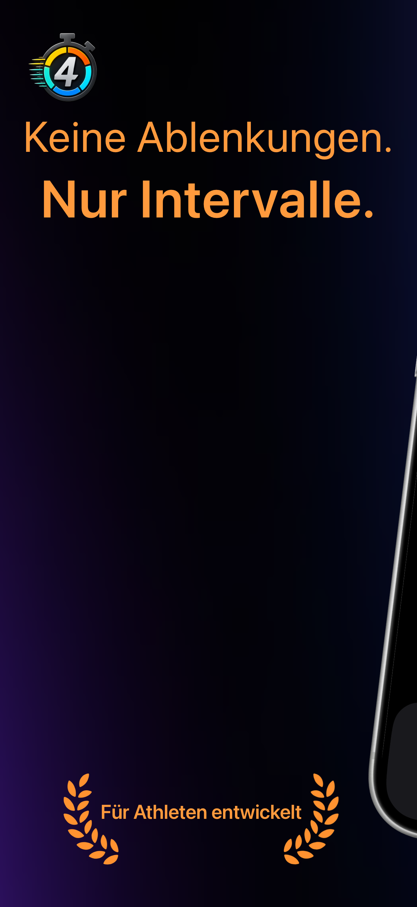
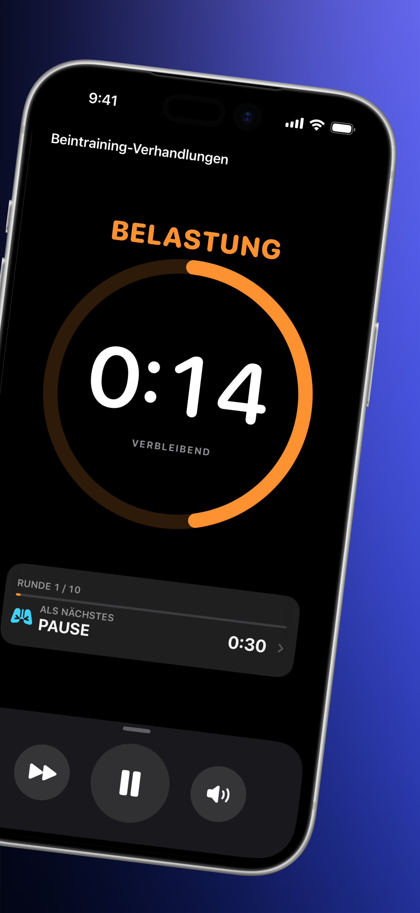
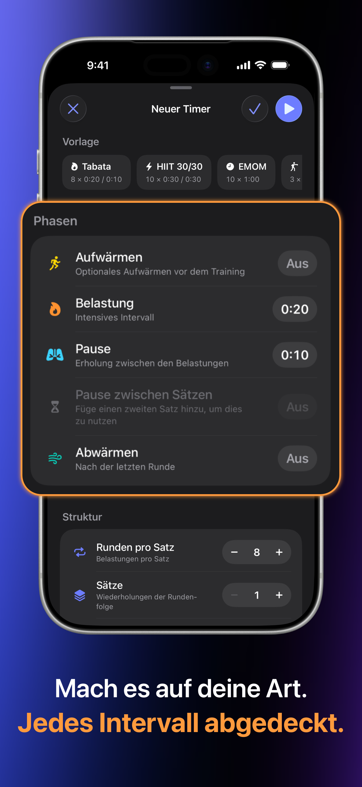
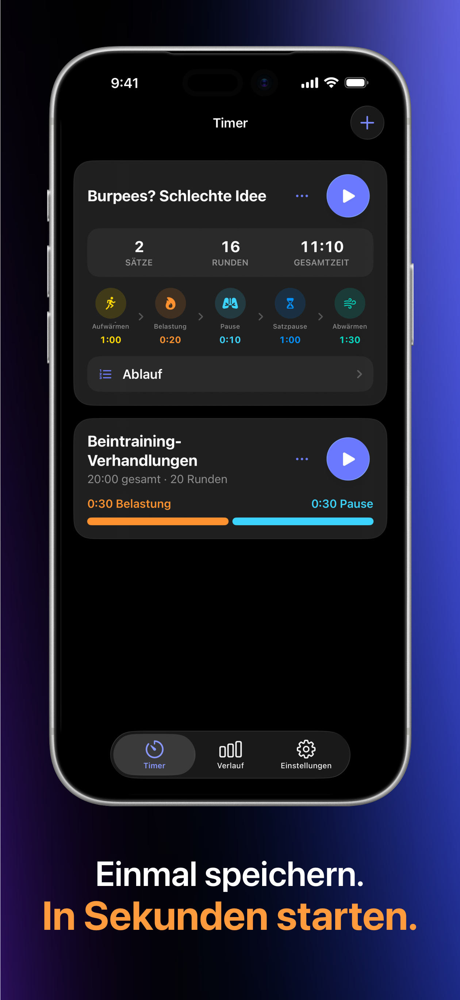
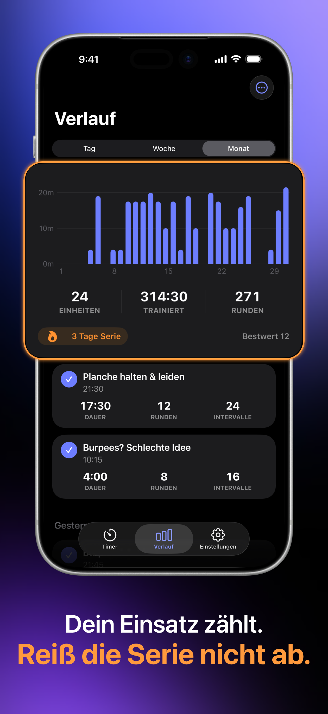
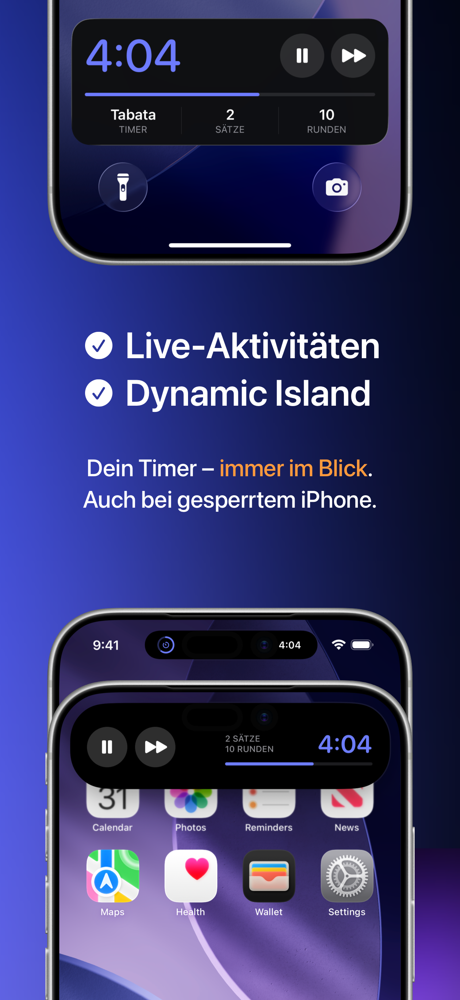
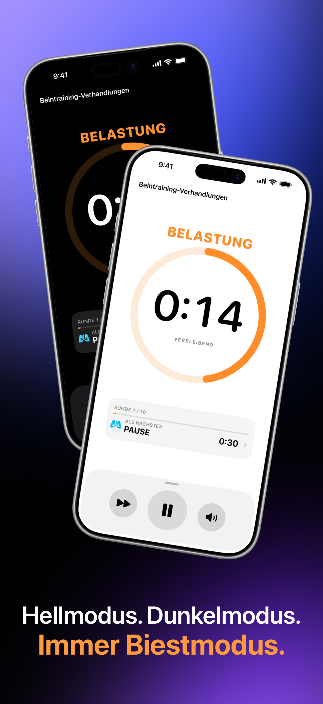

# FourEver

### Keine Ablenkungen. Nur Intervalle.

**Ein fokussierter, ausdrucksstarker Intervall-Timer für Tabata, HIIT und jeden Trainingsrhythmus.**

Nativ entwickelt für iOS (SwiftUI).

  <b>Sprachen / Languages:</b> <a href="README.md">English</a> | <b>Deutsch</b> | [Українська](README.uk.md)

> [!TIP]
>  **iOS:** Jetzt im App Store verfügbar — [FourEver für iOS herunterladen](https://apps.apple.com/us/app/id6795558386)

 

## Einblicke in FourEver

Übersichtlich, wenn es hart wird. Jedes Intervall abgedeckt, Live-Aktivitäten auf Ihrem Sperrbildschirm und ein privater Verlauf.

  
  &nbsp;&nbsp;
  

  <b>Von einem Athleten für Athleten entwickelt</b> &nbsp;•&nbsp; <b>Fokus auf das nächste Intervall</b>

  
  &nbsp;&nbsp;
  

  <b>Mach es auf deine Art. Jedes Intervall abgedeckt.</b> &nbsp;•&nbsp; <b>Einmal speichern. In Sekunden starten.</b>

  
  &nbsp;&nbsp;
  
  &nbsp;&nbsp;
  

  <b>Dein Einsatz zählt. Reiß die Serie nicht ab.</b> &nbsp;•&nbsp; <b>Dein Timer – immer im Blick.</b> &nbsp;•&nbsp; <b>Hellmodus. Dunkelmodus. Immer Biestmodus.</b>

---

## 🥋 Über den Entwickler

Hallo! Ich bin **Alex (Oleksandr Siholaiev)** — Karate-Athlet und Software-Entwickler.

Ich habe **FourEver** entwickelt, weil ich einen nativen, ablenkungsfreien Intervall-Timer brauchte, der während intensiver Trainingseinheiten nicht im Weg steht. Keine Werbung, keine Benutzerkonten, keine Abonnements — 100% fokussiert auf Leistung und Datenschutz (100% offline ohne Analysen und ohne Tracking).

- 🌐 **Webseite:** [sigolord.github.io/fourever-privacy/de/](https://sigolord.github.io/fourever-privacy/de/)
- 😎 **GitHub:** [@sigolord](https://github.com/sigolord)
- ✉️ **Kontakt / Support:** [fourever.support@proton.me](mailto:fourever.support@proton.me)
- 🖱️ **Weitere Tools:** [Fix4Mac](https://github.com/sigolord/Fix4Mac) — Open-Source macOS-Tool für Mausbeschleunigung & Scrollrichtung

---

[Webseite](https://sigolord.github.io/fourever-privacy/de/) • [App Store (iOS)](https://apps.apple.com/us/app/id6795558386) • [Datenschutz](https://sigolord.github.io/fourever-privacy/de/privacy-policy/) • [Support](https://sigolord.github.io/fourever-privacy/de/support/) • [Fix4Mac](https://github.com/sigolord/Fix4Mac)

