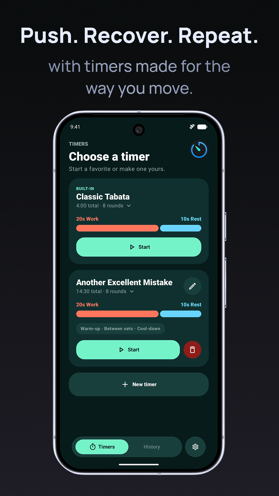
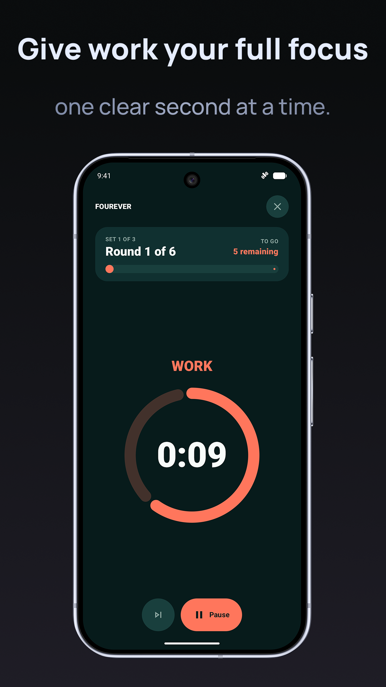
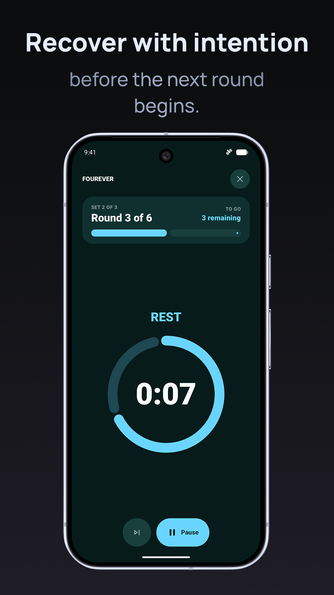
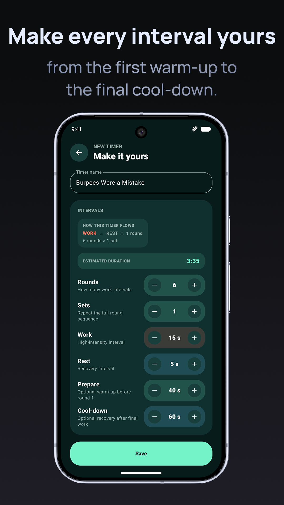
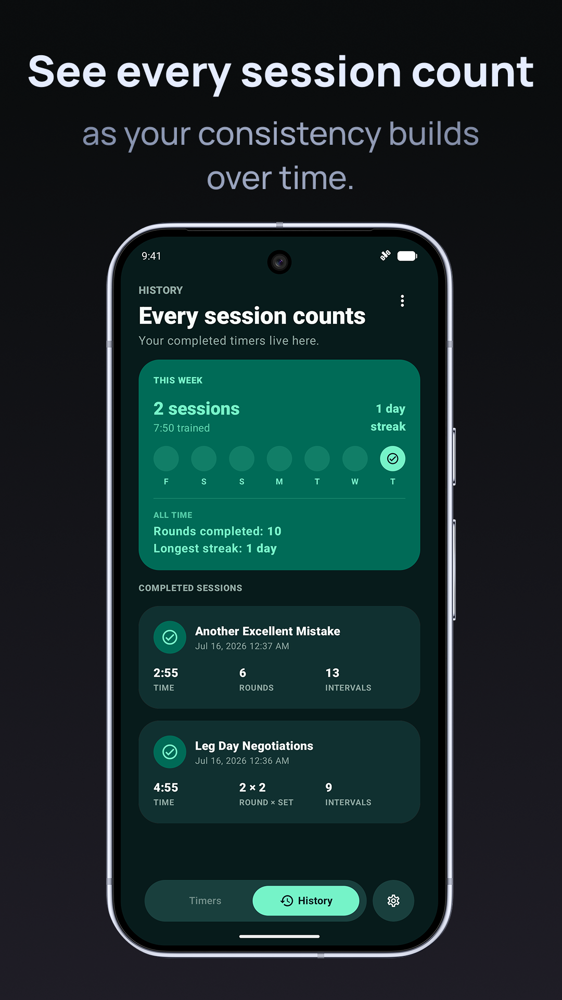
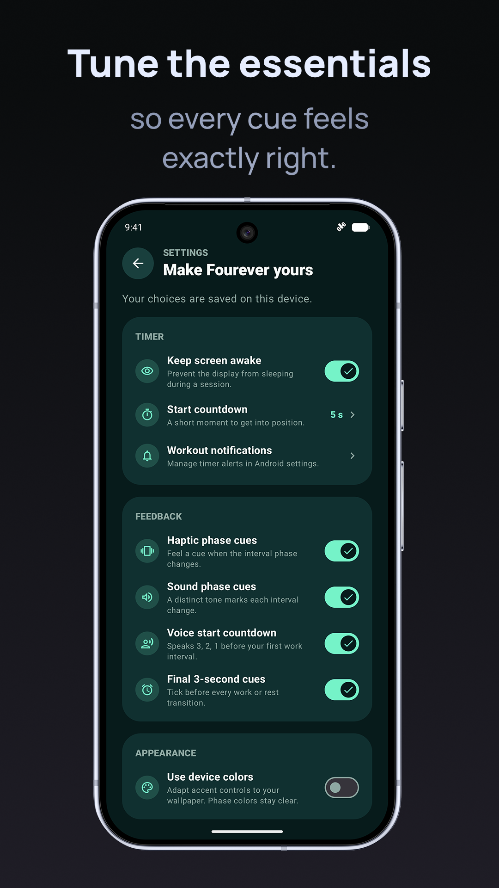
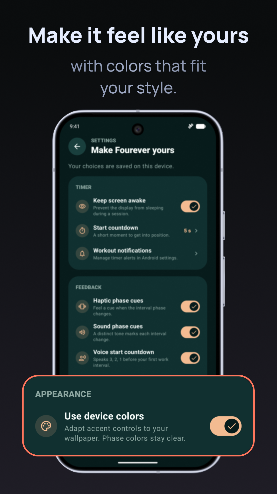
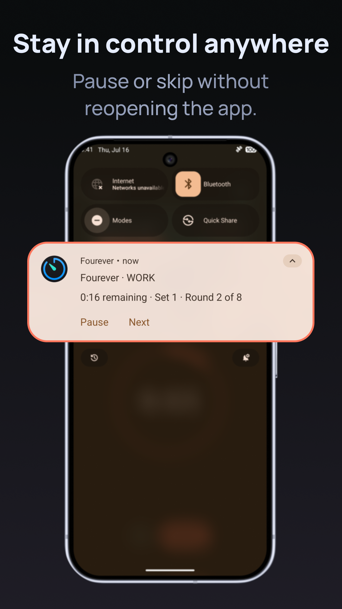

# Fourever

### Push. Recover. Repeat.

**A focused, expressive interval timer for Tabata, HIIT, and every rhythm you train to.**

Built natively for Android with Kotlin, Jetpack Compose, and Material 3 Expressive.

 

## Designed around rhythm

Fourever keeps interval training simple: choose a timer, focus on the current phase, recover with intention, and repeat. Work and rest are instantly recognizable through their own clear visual language.

  
  
  

## Make every interval yours

Create timers that match the way you move. Configure rounds, sets, work and rest durations, an optional warm-up, and a cool-down — with an estimated session duration that updates as you edit.

  

## See every session count

Completed sessions are saved locally, with a weekly activity view, all-time round totals, streaks, and a detailed session history.

  

## Tune the essentials

Make each session feel right with a start countdown, optional haptic and sound cues, voice countdowns, final-three-second cues, keep-screen-awake support, and Android notification controls.

  
  
  

## Highlights

- Classic Tabata included: 8 rounds of 20 seconds work and 10 seconds rest.
- Fully customizable timers with rounds, sets, warm-up, and cool-down phases.
- Smooth, high-contrast work and rest timer screens.
- In-session pause and skip controls, including foreground notification actions.
- Local timer, settings, history, and active-session persistence.
- Haptic, sound, voice, and final-countdown feedback options.
- Optional device-color accents while keeping phase colors clear.
- Privacy-conscious by design: your timers and history stay on your device.

## Run locally

1. Clone this repository.
2. Open it in the latest stable Android Studio.
3. Let Gradle sync, then select an Android device or emulator.
4. Run the `app` configuration.

## Privacy and support

- [Privacy policy](https://sigolord.github.io/fourever-privacy/)
- Support: [fourever.support@proton.me](mailto:fourever.support@proton.me)

