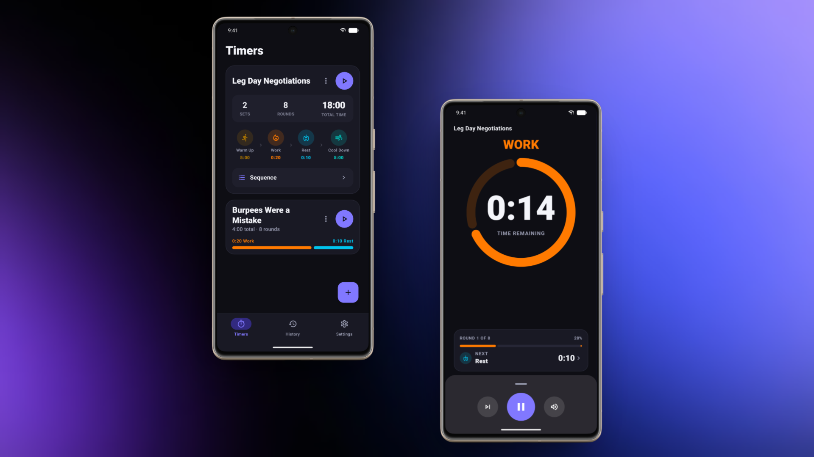
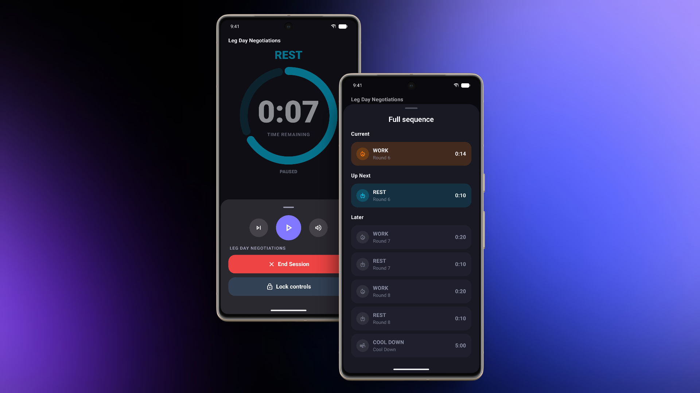
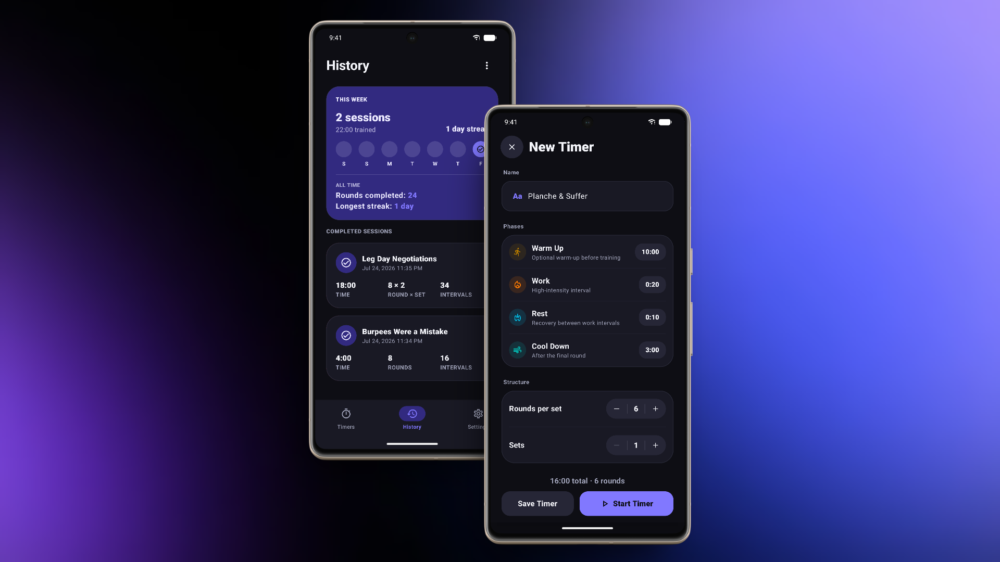
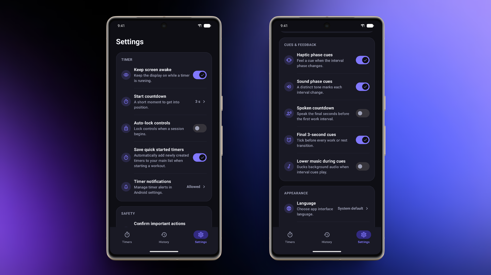
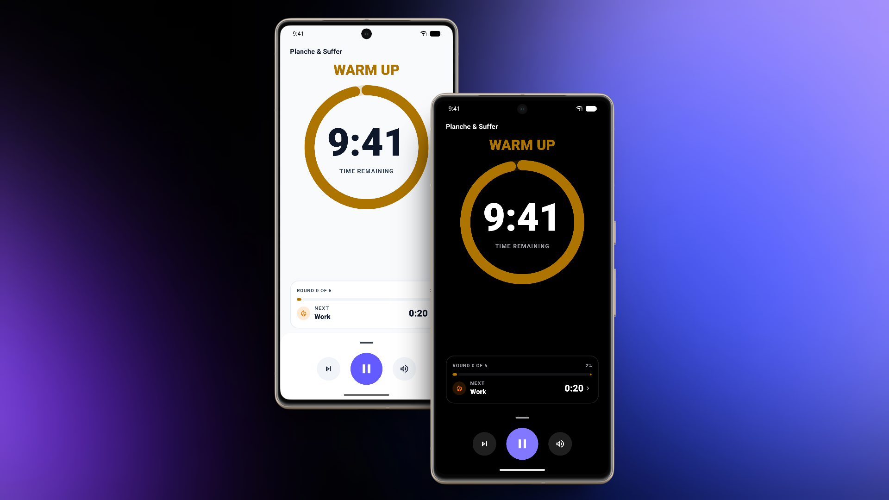

# Fourever

### Push. Recover. Repeat.

**A focused, expressive interval timer for Tabata, HIIT, and every rhythm you train to.**

 

## Timers & Active Workout

High-visibility work phases designed to keep you locked in. Comes with pre-configured Tabata presets ready out of the box.

  

## In-Session Controls & Sequence Pacing

Stay in full command mid-session. Swipe up the live sequence drawer to see upcoming rounds, lock controls against accidental taps, or skip intervals directly.

  

## History & Custom Builder

Configure custom rounds, sets, warm-ups, and cool-downs with real-time duration math. Track your workouts, streaks, and all-time rounds locally.

  

## Audio Ducking & Fine Tuning

Automatically lowers background music volume when interval cues or spoken countdowns play, so you never miss a transition.

  

## Expressive Light & Dark Themes

Clean, high-contrast visual design built for daylight workouts or low-light dark mode.

  

---

[Privacy Policy](https://sigolord.github.io/fourever-privacy/) • [Support](mailto:fourever.support@proton.me)

