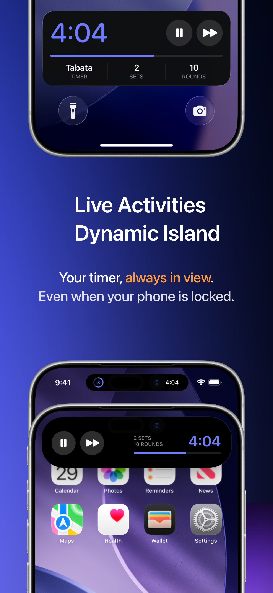
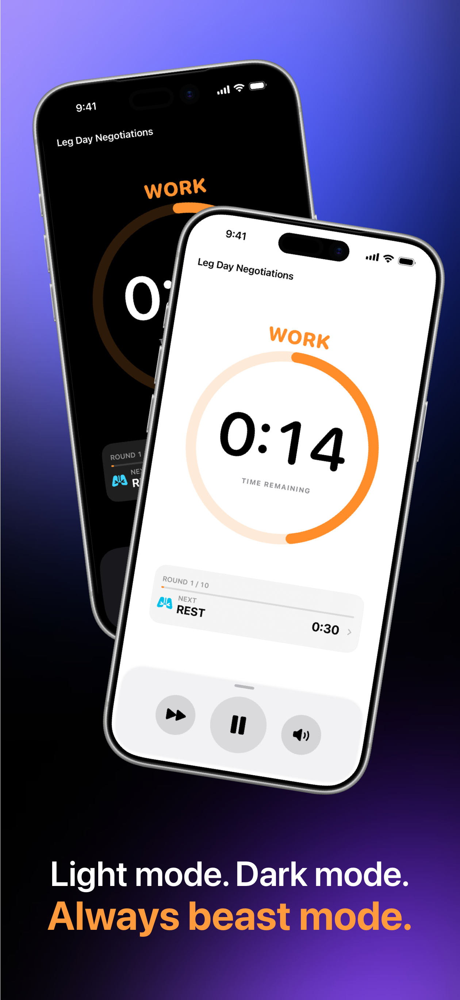

# FourEver

### Push. Recover. Repeat.

**A focused, expressive interval timer for Tabata, HIIT, and every rhythm you train to.**

Built natively for iOS (SwiftUI).

  <b>Languages / Sprachen:</b> <b>English</b> | <a href="README.de.md">Deutsch</a> | [Українська](README.ua.md)

> [!TIP]
>  **iOS:** Live on the App Store — [Download FourEver for iOS](https://apps.apple.com/us/app/id6795558386)

 

## Inside FourEver

Clear when the workout gets hard. Every interval covered, Live Activities on your Lock Screen, and private history.

  
  &nbsp;&nbsp;
  

  <b>Built by an athlete, for athletes</b> &nbsp;•&nbsp; <b>Focused on the next interval</b>

  
  &nbsp;&nbsp;
  

  <b>Every interval, covered.</b> &nbsp;•&nbsp; <b>Save once, start fast.</b>

  
  &nbsp;&nbsp;
  
  &nbsp;&nbsp;
  

  <b>Progress you can see</b> &nbsp;•&nbsp; <b>Your workout stays in view</b> &nbsp;•&nbsp; <b>Light and dark modes</b>

---

## 🥋 About the Developer

Hi! I'm **Alex (Oleksandr Siholaiev)** — a karate athlete and software developer.

I built **FourEver** because I needed a native, distraction-free interval clock that stays completely out of the way during intense training sessions. Zero ads, zero user accounts, zero subscriptions — 100% focused on performance and privacy (100% offline with zero analytics and zero tracking).

- 🌐 **Website:** [sigolord.github.io/fourever-privacy](https://sigolord.github.io/fourever-privacy/)
- 😎 **GitHub:** [@sigolord](https://github.com/sigolord)
- ✉️ **Contact / Support:** [fourever.support@proton.me](mailto:fourever.support@proton.me)
- 🖱️ **Other Tools:** [Fix4Mac](https://github.com/sigolord/Fix4Mac) — Open-source macOS mouse acceleration & scroll direction control utility

---

[Website](https://sigolord.github.io/fourever-privacy/) • [App Store (iOS)](https://apps.apple.com/us/app/id6795558386) • [Privacy Center](https://sigolord.github.io/fourever-privacy/privacy-policy/) • [Support](https://sigolord.github.io/fourever-privacy/support/) • [Fix4Mac](https://github.com/sigolord/Fix4Mac)

