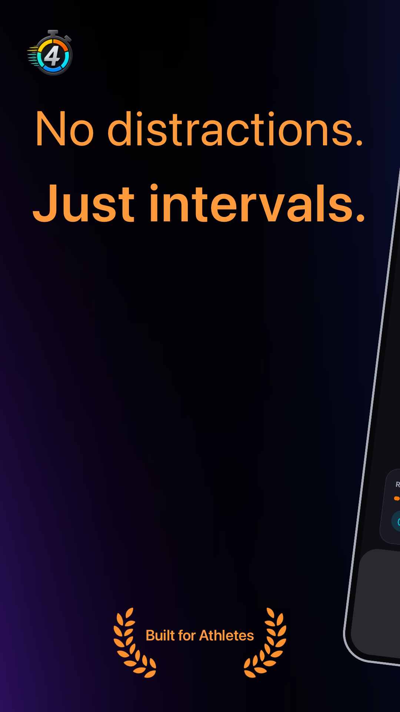
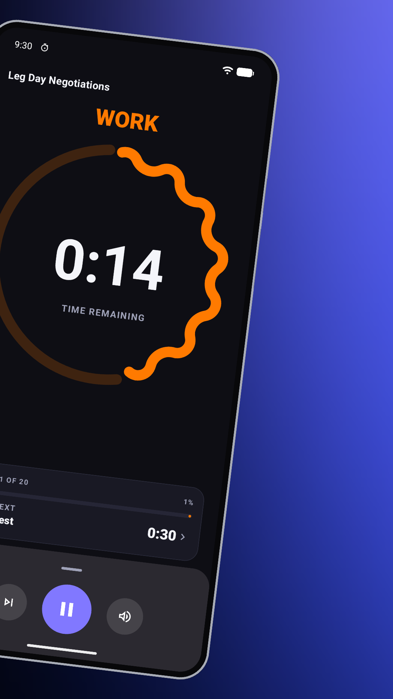
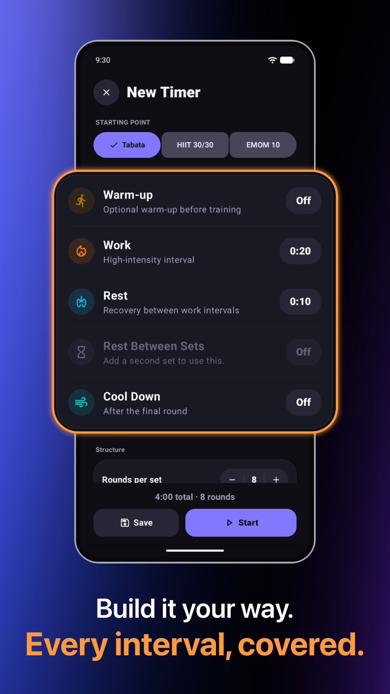
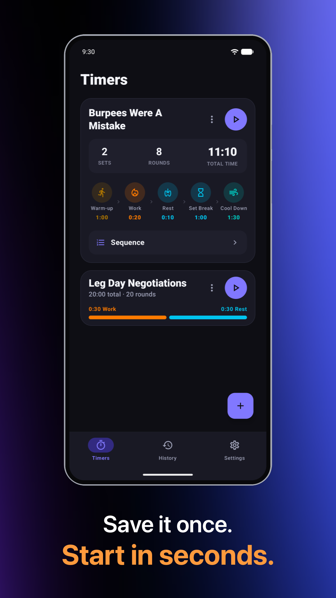
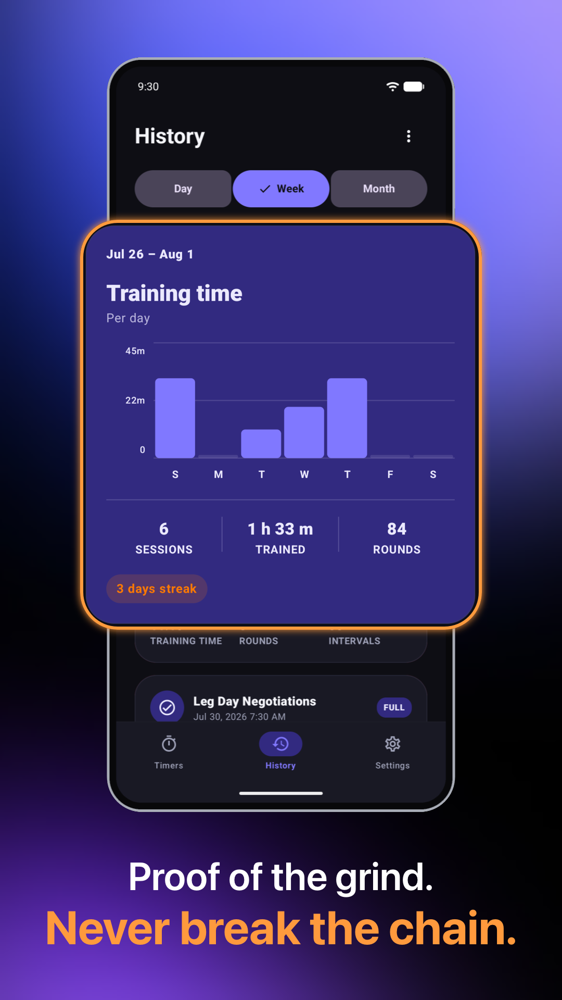
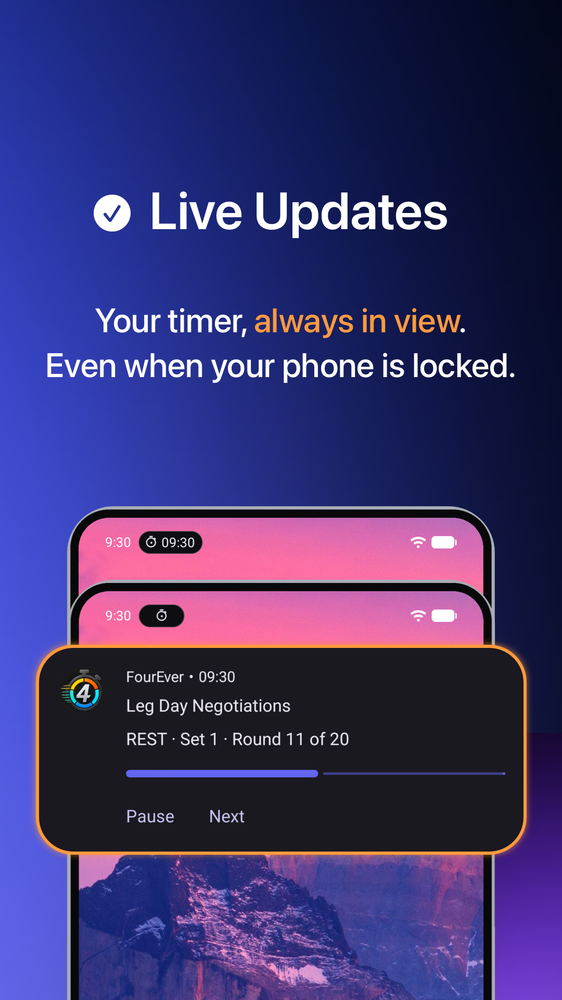
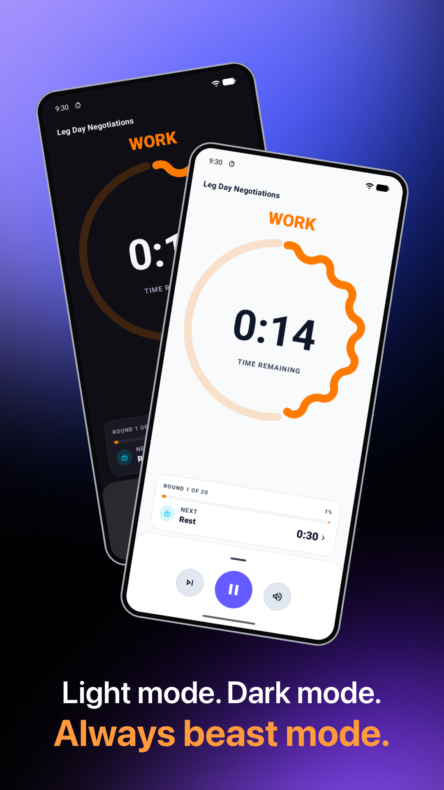

# FourEver

### Без відволікань. Тільки інтервали.

**Сфокусований, виразний інтервальний таймер для Tabata, HIIT та будь-якого ритму тренувань.**

Створено нативно для iOS (SwiftUI) та Android (Jetpack Compose & Material 3).

  <b>Мови / Languages:</b> <a href="README.md">English</a> | <a href="README.de.md">Deutsch</a> | <b>Українська</b>

> [!TIP]
> **Завантажити FourEver**
>  
>  **iOS:** [📱 Завантажити для iOS (App Store)](https://apps.apple.com/us/app/id6795558386)
>  
>  **Android:** Відкрите бета-тестування у Google Play:
> 1. [Приєднатися до групи тестувальників](https://groups.google.com/g/fourever-testers)
> 2. [Прийняти бета-доступ у Google Play](https://play.google.com/apps/testing/com.sigolord.fourever.timer)
> 3. [Завантажити у Google Play](https://play.google.com/store/apps/details?id=com.sigolord.fourever.timer)

 

##  🤖 Встановити на Android (3 кроки бета-тестування)

FourEver для Android зараз знаходиться у **відкритому бета-тестуванні** на Google Play! Щоб встановити додаток на свій Android-пристрій, виконайте 3 прості кроки:

1. 👥 **Приєднатися до групи тестувальників Google:** [groups.google.com/g/fourever-testers](https://groups.google.com/g/fourever-testers)
2. 📲 **Прийняти бета-доступ у Google Play:** [play.google.com/apps/testing/com.sigolord.fourever.timer](https://play.google.com/apps/testing/com.sigolord.fourever.timer)
3. 📥 **Завантажити у Google Play:** [play.google.com/store/apps/details?id=com.sigolord.fourever.timer](https://play.google.com/store/apps/details?id=com.sigolord.fourever.timer)

---

##  Всередині FourEver — iOS

Чіткість, коли тренування стає важким. Кожен інтервал враховано, Live Activities на екрані блокування та приватна історія.

  
  &nbsp;&nbsp;
  

  <b>Створено атлетом для атлетів</b> &nbsp;•&nbsp; <b>Фокус на наступному інтервалі</b>

  
  &nbsp;&nbsp;
  

  <b>Все по-твоєму. Кожен інтервал.</b> &nbsp;•&nbsp; <b>Збережи раз. Запускай за секунди.</b>

  
  &nbsp;&nbsp;
  
  &nbsp;&nbsp;
  

  <b>Твій прогрес. Не переривай серію.</b> &nbsp;•&nbsp; <b>Таймер завжди на виду.</b> &nbsp;•&nbsp; <b>Світла тема. Темна тема. Завжди на максимум.</b>

 

##  Всередині FourEver — Android

Сфокусовані інтервали роботи та відпочинку, виразний дизайн Material 3, активне керування сповіщеннями та локальна історія.

  
  &nbsp;&nbsp;
  

  <b>Бібліотека збережених таймерів</b> &nbsp;•&nbsp; <b>Фокус на наступному інтервалі</b>

  
  &nbsp;&nbsp;
  

  <b>Свідоме відновлення</b> &nbsp;•&nbsp; <b>Кожен інтервал враховано</b>

  
  &nbsp;&nbsp;
  
  &nbsp;&nbsp;
  

  <b>Прогрес, який видно</b> &nbsp;•&nbsp; <b>Тренування завжди на виду</b> &nbsp;•&nbsp; <b>Кольори Material 3 та пристрою</b>

---

## 🥋 Про розробника

Привіт! Я **Алекс (Олександр Сіголаєв)** — каратист та розробник програмного забезпечення.

Я створив **FourEver**, тому що мені потрібен був нативний інтервальний таймер без відволікань, який не заважає під час інтенсивних тренувань. Жодної реклами, облікових записів або підписок — 100% фокус на продуктивності та конфіденційності (100% офлайн без аналітики на iOS; локальне збереження тренувань з анонімною діагностикою збоїв Firebase на Android).

- 🌐 **Вебсайт:** [sigolord.github.io/fourever-privacy/uk/](https://sigolord.github.io/fourever-privacy/uk/)
- 😎 **GitHub:** [@sigolord](https://github.com/sigolord)
- ✉️ **Контакти / Підтримка:** [fourever.support@proton.me](mailto:fourever.support@proton.me)
- 🖱️ **Інші інструменти:** [Fix4Mac](https://github.com/sigolord/Fix4Mac) — Інструмент з відкритим вихідним кодом для керування прискоренням миші та напрямком прокрутки на macOS

---

[Вебсайт](https://sigolord.github.io/fourever-privacy/uk/) • [App Store (iOS)](https://apps.apple.com/us/app/id6795558386) • [Android Beta](https://play.google.com/apps/testing/com.sigolord.fourever.timer) • [Конфіденційність](https://sigolord.github.io/fourever-privacy/uk/privacy-policy/) • [Підтримка](https://sigolord.github.io/fourever-privacy/uk/support/) • [Fix4Mac](https://github.com/sigolord/Fix4Mac)

