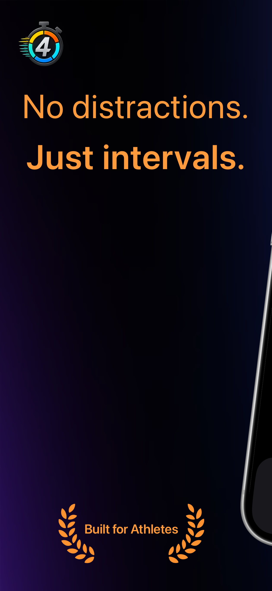
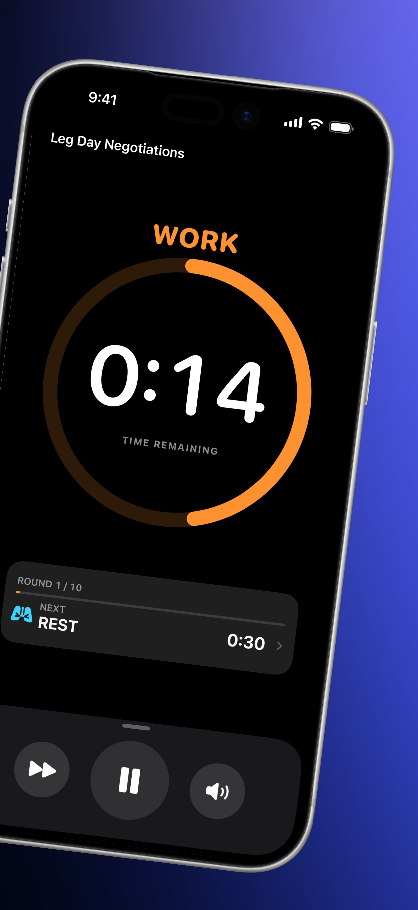
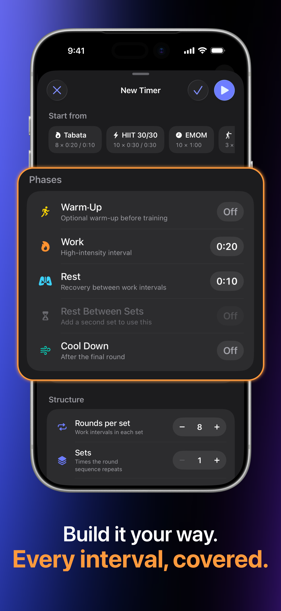
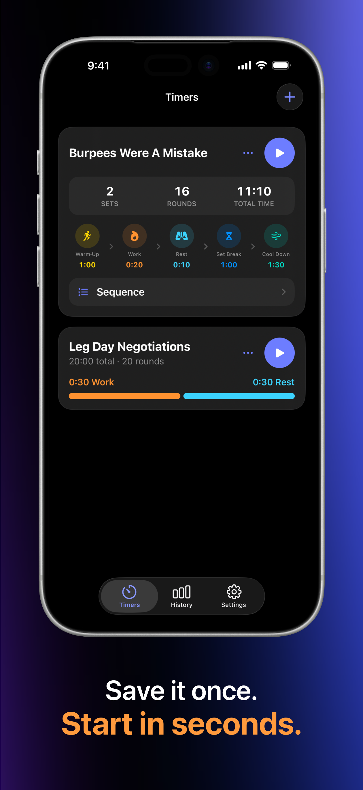
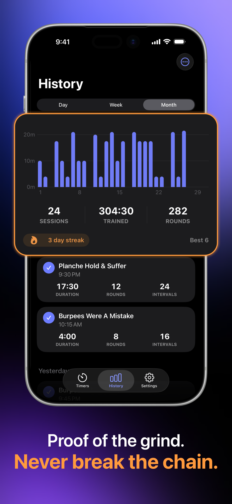
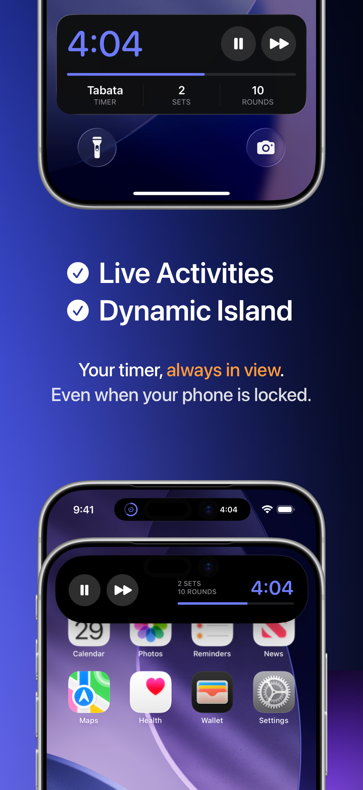

# FourEver

### Без відволікань. Тільки інтервали.

**Сфокусований, виразний інтервальний таймер для Tabata, HIIT та будь-якого ритму тренувань.**

Створено нативно для iOS (SwiftUI).

  <b>Мови / Languages:</b> <a href="README.md">English</a> | <a href="README.de.md">Deutsch</a> | <b>Українська</b>

> [!TIP]
>  **iOS:** Доступно в App Store — [Завантажити FourEver для iOS](https://apps.apple.com/us/app/id6795558386)

 

## Всередині FourEver

Чіткість, коли тренування стає важким. Кожен інтервал враховано, Live Activities на екрані блокування та приватна історія.

  
  &nbsp;&nbsp;
  

  <b>Створено атлетом для атлетів</b> &nbsp;•&nbsp; <b>Фокус на наступному інтервалі</b>

  
  &nbsp;&nbsp;
  

  <b>Все по-твоєму. Кожен інтервал.</b> &nbsp;•&nbsp; <b>Збережи раз. Запускай за секунди.</b>

  
  &nbsp;&nbsp;
  
  &nbsp;&nbsp;
  

  <b>Твій прогрес. Не переривай серію.</b> &nbsp;•&nbsp; <b>Таймер завжди на виду.</b> &nbsp;•&nbsp; <b>Світла тема. Темна тема. Завжди на максимум.</b>

---

## 🥋 Про розробника

Привіт! Я **Алекс (Олександр Сіголаєв)** — каратист та розробник програмного забезпечення.

Я створив **FourEver**, тому що мені потрібен був нативний інтервальний таймер без відволікань, який не заважає під час інтенсивних тренувань. Жодної реклами, облікових записів або підписок — 100% фокус на продуктивності та конфіденційності (100% офлайн без аналітики та відстеження).

- 🌐 **Вебсайт:** [sigolord.github.io/fourever-privacy/uk/](https://sigolord.github.io/fourever-privacy/uk/)
- 😎 **GitHub:** [@sigolord](https://github.com/sigolord)
- ✉️ **Контакти / Підтримка:** [fourever.support@proton.me](mailto:fourever.support@proton.me)
- 🖱️ **Інші інструменти:** [Fix4Mac](https://github.com/sigolord/Fix4Mac) — Інструмент з відкритим вихідним кодом для керування прискоренням миші та напрямком прокрутки на macOS

---

[Вебсайт](https://sigolord.github.io/fourever-privacy/uk/) • [App Store (iOS)](https://apps.apple.com/us/app/id6795558386) • [Конфіденційність](https://sigolord.github.io/fourever-privacy/uk/privacy-policy/) • [Підтримка](https://sigolord.github.io/fourever-privacy/uk/support/) • [Fix4Mac](https://github.com/sigolord/Fix4Mac)

